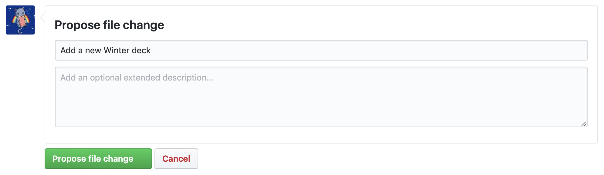
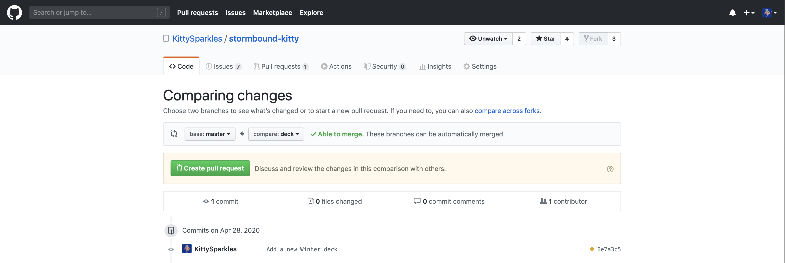

# Adding a deck

Here is how your could add a deck on your own to Stormbound-Kitty. It consists on 2 main steps: adding your deck to the storage file and submitting it for review.

- [Logging into GitHub](#logging-into-github)
- [Adding your deck](#adding-your-deck)
- [Submitting your deck](#submitting-your-deck)

## Logging into GitHub

Log into your GitHub account. GitHub is a platform to collaboratively work on (open-source) code. It is almost an industry standard, very secure, and you shouldn’t be scared to create an account.

## Adding your deck

Go to https://github.com/KittySparkles/stormbound-kitty/edit/main/src/data/decks.json. This will open a page with a big form where you will get to update the content.

This file you will edit is the one containing all the decks from the site. Technically speaking, this is a JSON file exporting an “array” (a collection) of “objects” (small key-value dictionaries), and each object has:

- a `name`: the name of the deck
- an `author`: your nickname
- an `id`: which can be found in the URL of the deck builder
- a `date`: the month and year of the deck (e.g. `07/2021`)
- some `tags`: at least one amongst `STARTER`, `REGULAR`, `HIGH_LEVELS`, `BRAWL`, `EQUALS`, `RUSH`, `CONTROL`, and the Brawl IDs (`DWARF_MANA`, `PIRATE_MANA`, `RAVEN_MOVEMENT`, `STRUCTURE_MANA`, `RODENT_STRENGTH`, `PIRATE_MOVEMENT`, `FELINE_STRENGTH`, `SATYR_MOVEMENT`, `SPELL_MANA`, `FROSTLING_STRENGTH`, `TOAD_MANA`, `ELDER_STRENGTH`, `CONSTRUCT_MOVEMENT`, `KNIGHT_MANA`, `DRAGON_MOVEMENT`, `UNDEAD_STRENGTH`, `HERO_STRENGTH`, `PURE_AMALGAMATION`, `FIGHTS_OF_THREES`, `THIN_NO_MANS_LAND`, `STUNNING_ATTACK`)

> ❔ When creating your deck in the deck builder to have its identifier from the URL, please use all cards level 1 for a `EQUALS` deck, all cards level 3 for a `REGULAR` deck and all cards level 5 for a `HIGH_LEVELS` or `BRAWL` deck.


At the bottom of the file, add a comma (`,`) after the closing bracket (`}`) of the last deck, then add your deck object there, like it is done for all of them. Look how it’s done, and do the same. It should be relatively straightforward. The main structure of the file should be like this:

```json
[
  {
    // A deck here …
  },
  // … more decks here …
  {
    // … your deck there.
  }
]
```

> ❔ If you’re a little scared of working directly in the browser, feel free to copy the content into a text editor of your choice such as Notepad. Nothing like Word or Google Docs however as it will replace quotation marks with curly quotes. Once you’re happy with the result, paste your content back into the big text area.

## Submitting your deck

At the bottom of the page, there is a “Propose file change” form. Fill the first field with the description of your change, such as “Add a new Winter deck”. You can leave the description empty.



Once you’ve submitted this, you’ll be redirected to a page that invites you to create a “pull request” (that is, a code change suggestion). Click the big green “Create pull request” button, which should redirect you to your pull-request page.



From there, I can review your code addition, make changes if necessary, and merge it. You can just let me know you created a pull-request on Discord and I will have a look at it. :)
