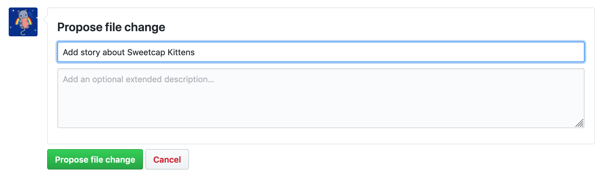
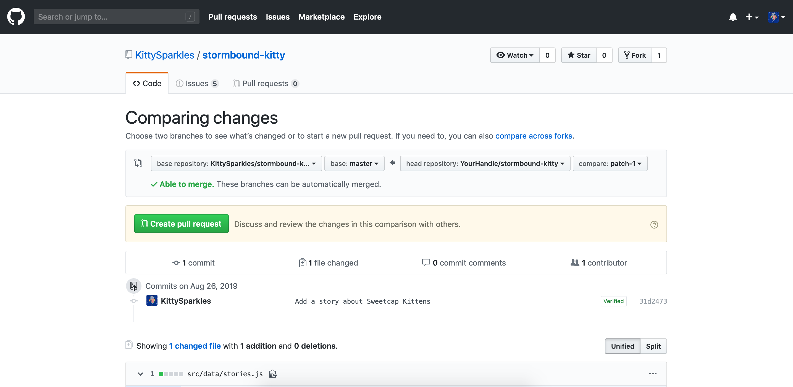

# Adding a story

Here is how your could add a story on your own to Stormbound Kitty. It consists on 2 main steps: adding your story to the main file and submitting it for review.

- [Logging into GitHub](#logging-into-github)
- [Adding your story](#adding-your-story)
- [Submitting your story](#submitting-your-story)

## Logging into GitHub

Log into your GitHub account. GitHub is a platform to collaboratively work on (open-source) code. It is almost an industry standard, very secure, and you shouldn’t be scared to create an account.

## Adding your story

Go to https://github.com/KittySparkles/stormbound-kitty/edit/master/src/data/stories.js. This will open a page with a big form where you will get to update the content.

This file you will edit is the one containing all the stories from the site. Technically speaking, this is a JavaScript file exporting an “array” (a collection) of “objects” (small key-value maps), and each object has a `title` key (the name of the story, usually the card name), a `content` key (the actual story), an `author` key (your nickname) and a `cardId` key (which can be found in the [`cards.json` file](https://github.com/KittySparkles/stormbound-kitty/blob/master/src/data/cards.json)).


At the bottom of the file, add a comma (`,`) after the closing bracket (`}`) of the last story, then add your story object there, like it is done for all of them. Look how it’s done, and do the same. It should be relatively straightforward. The main structure of the file should be like this:

```js
export default [
  {
    // A story here …
  },
  // … more stories here …
  {
    // … your story there.
  },
]
```

> ❔ If you’re a little scared of working directly in the browser, feel free to copy the content into a text editor of your choice such as Notepad or Notepad++. Nothing like Word or Google Docs however as it will replace quotation marks with straight quotes and things like this. Once you’re happy with the result, paste your content back into the big text area.

## Submitting your story

At the bottom of the page, there is a “Propose file change” form. Fill the first field with the description of your change, such as “Add story about Sweetcap Kittens”. You can leave the description empty.



Once you’ve submitted this, you’ll be redirected to a page that invites you to create a “pull request” (that is, a code change suggestion). Click the big green “Create pull request” button, which should redirect you to your pull-request page.



From there, I can review your code addition, make changes if necessary, and merge it. You can just let me know you created a pull-request on Discord and I will have a look at it. :)
